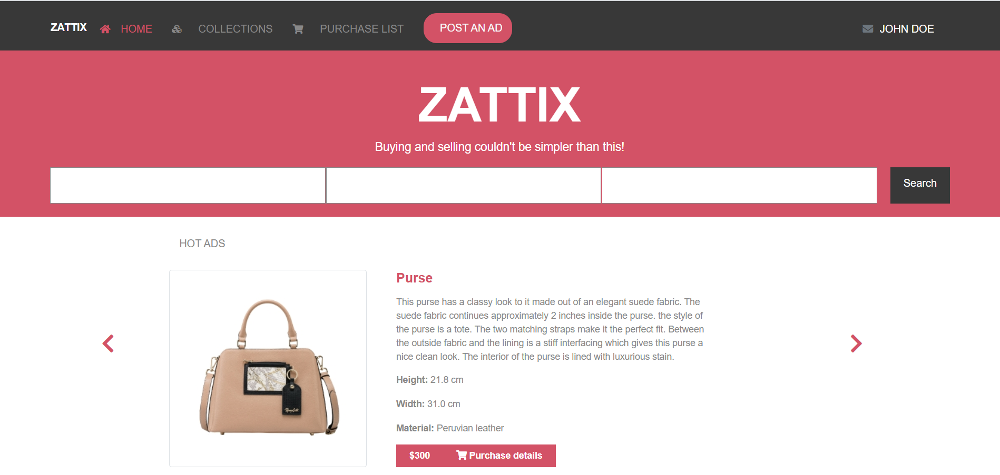
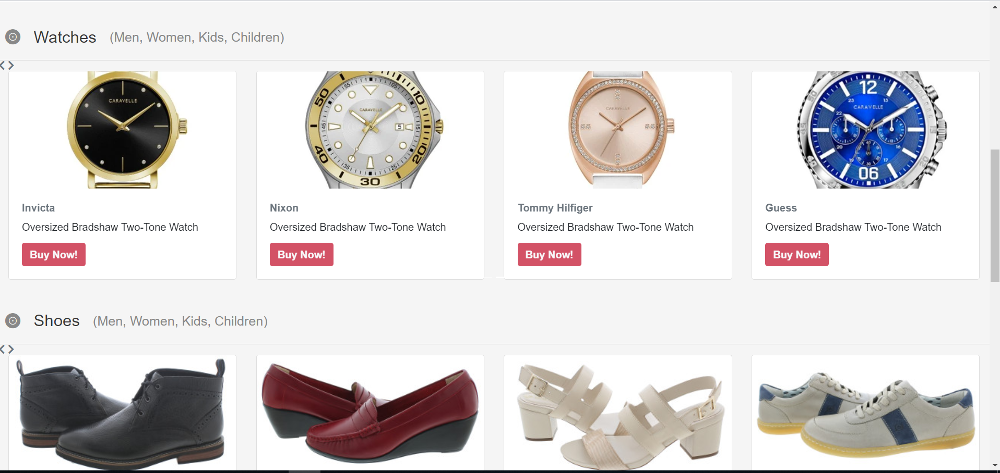
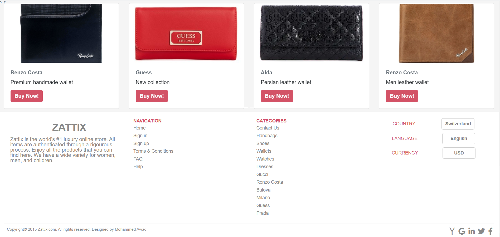
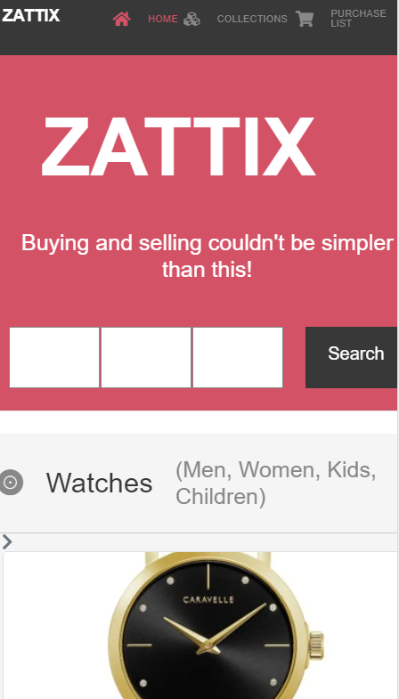
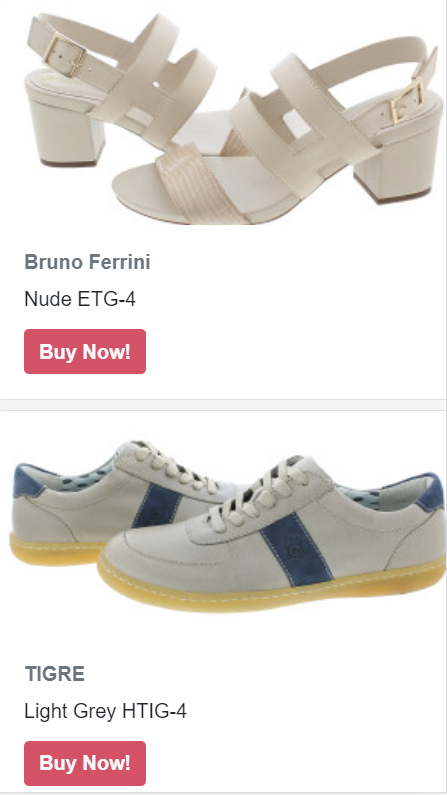
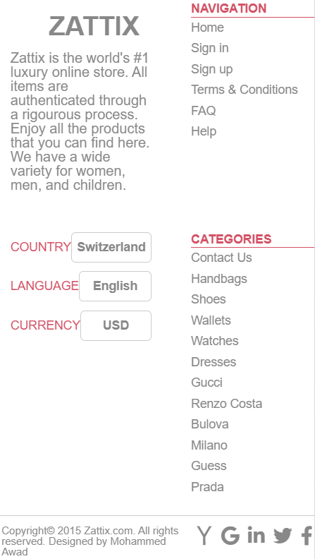
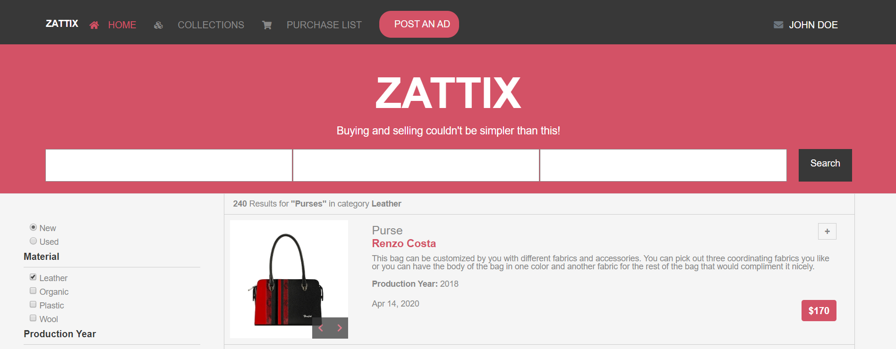
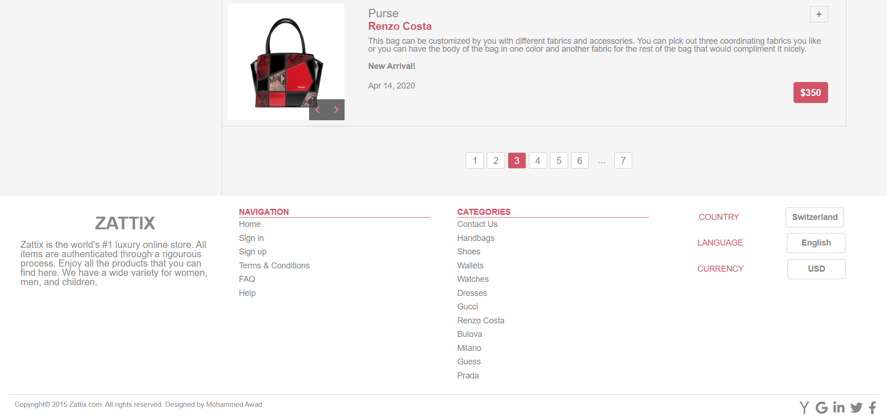
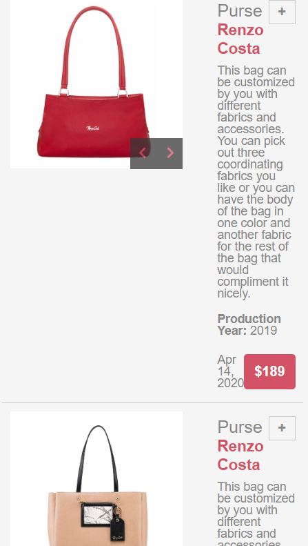
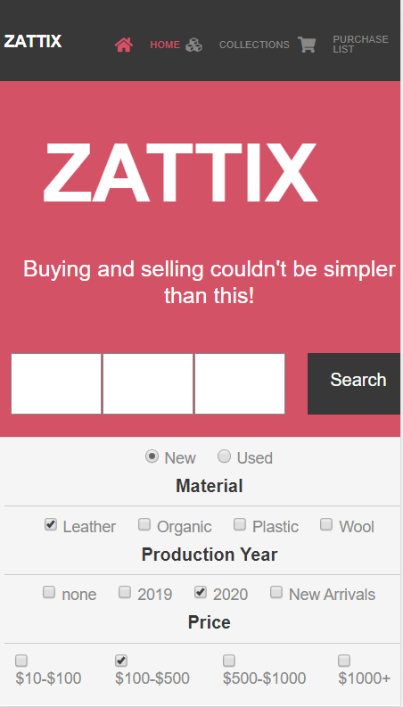

# Capstone-Project
This is the last project in the HTML/CSS section of the main curriculum in the Microverse Full-Stack Development course. For that reason, I've tried to pour all the knowledge I've acquired over the entire section of the curriculum in this project.

I had to create 2 pages, as follows:

The index page - Desktop Version

-Mobile Version

The Search Page -Desktop Version

-Mobile Version

# Built With
- HTML
- CSS
- BOOTSTRAP

# Live demo link
The project can be found in this link https://capstone-project-maria.netlify.com/

Note: To see the second page you have to click the button "Search" or the elements in the Navbar.

# Author

👤 María de los Angeles Hinojosa Pretell

- Github: [@angelesh1995](https://github.com/Angelesh1995)
- Twitter: [@Maria_AngelesxD](https://twitter.com/Maria_AngelesxD)
- Linkedin: [Maria de los Angeles Hinojosa Pretell](https://www.linkedin.com/in/mar%C3%ADa-de-los-angeles-hinojosa-pretell-99935a66/)

# Contributing
Contributions, issues and feature requests are welcome!
Feel free to check the issues page.

# Show your support
- Give a ⭐️ if you like this project!

# Acknowledgments
Layout design by Mohammed Awad

Behance: M_Awad

Renzo Costa Purses

Ivan Diaz

